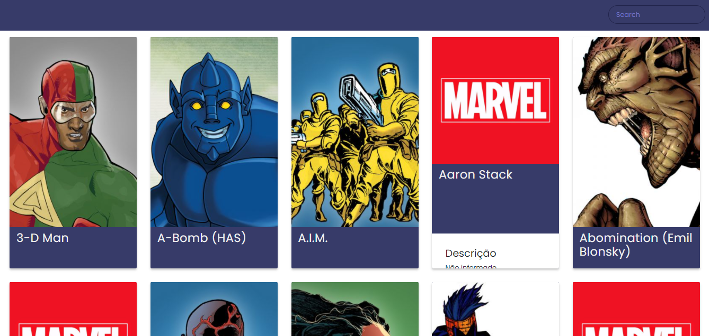

# API-Marvel-Front

Projeto entregue durante o curso Starter da [Growdev](https://www.growdev.com.br/).
Trata-se de uma aplicação front-end que consome uma API desenvolvida pelo aluno que,
por sua vez, consume a [API da Marvel](https://developer.marvel.com/) - trazendo
dados dos personagens.

Este repositório é o front-end da aplicação, construído utilizando Webpack e ES6+. 
O back-end da aplicação pode ser visto em [api-marvel-back](https://github.com/fpsaraiva/api-marvel-back).



##  :rocket: Funcionalidades

* Listagem geral dos personagens, mostrando nome, foto e descrição.
* Paginação da listagem, que permite visualizar todos os personagens disponíveis.
* Busca de personagens pelo nome.
* Caso não existam informações de descrição e imagem, mostrar o texto "Não informado"
e o logotipo da Marvel, respectivamente.

## Tecnologias

ES6+, Babel, Webpack

## :construction_worker: Como rodar

- Clonar o repo
- Instalar as dependências
```
yarn
```
- Rodar a aplicação
```
yarn dev
```
